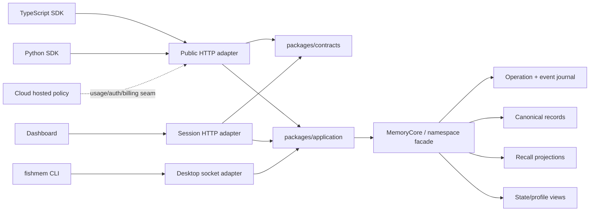

# FishMem Production Architecture

> Status: authoritative
>
> Last updated: 2026-07-31

This document owns FishMem's current memory semantics and module boundaries.
Historical raw-base experiments remain in benchmark reports and
`ROADMAP.md`; they do not define the production write path.

## Product invariant

FishMem has one memory kernel, one canonical writer, and three adapters:

| Surface | Adapter responsibility | What stays shared |
| --- | --- | --- |
| Desktop | Local socket, CLI, on-device E5, agent integration | Memory semantics, records, history, retrieval |
| Open source web | Authenticated HTTP and operator dashboard | Application use cases, contracts, kernel |
| FishMem Cloud | Managed auth, usage, billing, teams, operations | The complete open-source API/application path |

Commercial code may depend on open-source code. Open-source code never depends
on commercial code. Cloud must inject hosted policy at narrow seams instead of
forking request handlers or memory logic.

## Canonical write semantics

`infer` chooses how input becomes canonical memory:

```text
chat/content
    │
    ├── infer=true (default)
    │      one LLM extraction call
    │      validate + deduplicate extracted facts
    │      store only refined canonical records
    │
    └── infer=false
           zero LLM calls
           store each non-empty submitted record byte-for-byte
```

Rules:

1. There is no dual raw-plus-derived canonical write.
2. `infer=true` is fail-closed. Invalid extraction output or provider failure
   writes nothing and never falls back to raw input.
3. One inferred add makes one extraction call. State and typed-graph
   projection consume the same frozen extraction plan; they do not call the
   LLM again.
4. Exact duplicate facts inside one extraction batch are removed before
   writing.
5. `infer=false` uses trimming only to reject blank content. Stored content is
   otherwise unchanged.
6. Corrections are explicit `update`, `invalidate`, `delete`, or privileged
   `purge` operations. FishMem does not silently rewrite history.

This matches the useful high-level mem0 split—extraction by default, raw on
request—without copying its internal topology or accepting silent fallbacks.

## Conversation memory versus documents

Conversational and agent memory should be compact enough to inject into a
model prompt. Long text and files are a different domain:

```text
file / long text
    ├── immutable source object + checksum + metadata
    ├── deterministic chunks with source offsets
    └── keyword/vector RAG projection

durable conclusion selected from the document
    └── normal canonical memory add
```

The source and chunk projection must not be disguised as hundreds of personal
memory facts. Document chunks cite their source; durable conclusions enter the
normal memory writer only when an application or agent deliberately selects
them.

The source contract is implemented through one `DocumentCorpus`
module and the shared application/API path. It preserves exact UTF-8 content,
immutable versions, current heads, deterministic chunks with byte offsets,
hybrid retrieval, snapshot export/restore, tenant fencing, and permanent
source-family deletion. On Cloudflare, the exact original is stored in R2
through an internal `DocumentOriginalStore` seam while D1 keeps immutable
descriptors and deterministic chunks. Desktop and Node keep the same original
inline in their local relational store; the public document interface does not
change by adapter. The HTTP boundary is intentionally capped at 1,000,000
UTF-8 bytes. JSON text and multipart textual files enter the same application
command.

Binary and large-file ingestion enters through immutable source assets: D1 or
libSQL owns the durable operation, R2 or a local volume owns exact bytes and
lossless extraction artifacts, and a pinned asynchronous Docling adapter emits
Markdown back into the same `DocumentCorpus` writer. PDF, Office, EPUB, email,
image, and text uploads are capped at 25 MB and 300 pages; extracted Markdown
remains capped at 1 MB. Cloudflare Queue is only a wakeup path and cron repairs
missed delivery, so neither creates a second task store.

## Idempotent writer and journal

For an idempotent add:

1. bind the authenticated structural namespace;
2. hash the normalized command;
3. claim an operation by `(namespace_id, idempotency_key)`;
4. run extraction at most once;
5. freeze the prepared record plan and stable memory IDs on the operation;
6. write canonical records and required recall projection;
7. append journal events;
8. commit the original response.

A retry reuses the frozen plan and IDs. Reusing a key for a different command
returns a conflict.

Synchronous delete-all freezes up to 25,000 target IDs inline. Oversized or
over-budget plans fail before canonical deletion, avoiding both partial purges
and D1 row-limit failures. Larger scopes require a narrower partition today;
an asynchronous externalized target-set operation is a future scale path, not
an implicit fallback.

The journal is recovery and audit evidence, not a second API writer:

```text
memory_operations
  operation identity, request hash, frozen command plan, projection status

memory_events
  event identity, operation identity, memory identity, event type, payload

canonical memory projection
  current queryable record state
```

## Rebuildable projections

Canonical records and their journal/history are authoritative. Everything
below is a projection:

| Projection | Purpose | Failure behavior |
| --- | --- | --- |
| Vector/FTS | Candidate retrieval | Persist warning/repair state; never invent success |
| Entity/association graph | Relationship and multi-hop signals | Rebuild from canonical records |
| State sidecar | Current/as-of/history slot queries | Cite canonical `source_ids` |
| Profile | Progressive-disclosure context | Refresh explicitly/deferred; keep previous valid view on failure |
| Document chunks and indexes | Citation-ready source retrieval | Rebuild from canonical source versions |

Projection code cannot mutate canonical record content. A new retrieval signal
must replace or measurably outperform an existing stage; FishMem does not
accumulate parallel retrieval stacks indefinitely.

Pointer-oriented vector backends such as Cloudflare Vectorize store structural
keys plus a projection-content hash, not a second copy of canonical memory or
source text. Every candidate is rehydrated through D1 and rechecked against the
full namespace/user/agent/run/source filter before it can be returned. The
metadata index narrows candidates; it is never the final authorization fence.

The D1 adapter keeps the same `commitDocumentVersion` contract but uses a
dialect-native transactional batch: source descriptors and heads remain
ordinary rows while bounded JSON payloads are expanded into chunk rows with
`json_each`. `DocumentCorpus` writes the checksum-addressed R2 original before
that commit and replays both sides through the same operation journal. This
keeps large-source writes within a small query budget without changing
chunking or introducing a second document writer.

## Module boundaries



### `packages/fishmem`

Owns domain records, canonical mutation semantics, structural namespace
enforcement, journal/replay, retrieval, state/profile projection, snapshots,
and storage interfaces.

It does not own API keys, sessions, billing, credits, organizations, webhooks,
or dashboard presentation.

### `packages/contracts`

Owns Zod request/response schemas, snake-case wire types, stable errors, and
OpenAPI 3.1. Public routes, SDK tests, and documentation consume this contract.

There is no handwritten alternate response shape in Cloud or an SDK.

### `packages/application`

Owns use-case validation, optimistic concurrency, cursor policy, namespace
binding, and conversion between domain operations and stable application
results.

HTTP route files authenticate, invoke the application, and serialize. They do
not reimplement memory decisions.

### SDKs

- `@fishmem/sdk`: fetch-native HTTP entry for Node, Bun, Deno, Workers, and
  serverless runtimes.
- `@fishmem/sdk/desktop`: explicit Node-only `fishmem` CLI adapter.
- `fishmem`: synchronous/asynchronous Python HTTP clients plus Desktop CLI
  adapter.

The CLI machine contract is `fishmem call <method> --input <json>`. SDKs invoke
it with argument arrays, never through a shell.

## Desktop profile

Desktop is deliberately narrower than the service:

- Codex and Claude Code are the supported agent integrations.
- The agent Skill selects and distills durable content.
- Desktop forces `infer=false`; it does not run a chat LLM.
- Embeddings use only local quantized multilingual E5.
- Remote embedding providers, provider API keys, and keyword-only fallback are
  not supported.
- Add/search fail with a typed readiness error until the model and semantic
  index are ready.
- Records, history, keyword data, and vectors live in local SQLite/libSQL.

Desktop may expose the same record lifecycle through the SDK, but it does not
pretend to provide Cloud billing, organizations, webhooks, or managed
operations.

## Open-source service and Cloud

The open-source service is a complete production application surface:

- Bearer API keys with expiry and explicit permissions;
- structural project namespace binding;
- memory/state/profile/operation/export/import API;
- TypeScript and Python SDKs;
- operator dashboard, request evidence, warnings, provider usage, webhooks,
  backup, and repair workflows;
- self-hosted provider and storage configuration.

Structural `user`, `agent`, and `run` entities are derived from active
canonical records through the namespace facade. They are not a parallel entity
table and are distinct from named entities in the retrieval graph. One record
with multiple structural scope fields contributes to each matching scope view.

Advanced memory filters have one bounded logical AST and evaluator. Stores may
push down safe clauses, but hydrated canonical records always receive the same
residual check. `user_id`, `agent_id`, and `run_id` remain hard top-level scope
predicates and cannot be placed under OR.

FishMem Cloud adds only managed concerns:

- usage authorization and billing;
- teams, roles, audit, governance, SSO, retention, residency;
- managed scaling, backups, upgrades, SLA, and enterprise deployment.

Hosted memory handlers must call the open-source handler/application chain.
Hosted credits cannot alter memory semantics or response contracts.

## Retrieval policy

Default search makes zero LLM calls. It may combine versioned local signals:

1. semantic vector similarity;
2. lexical/FTS relevance;
3. event-time and recency signals;
4. typed association/graph expansion;
5. validity and supersession completion;
6. coverage/diversity selection.

LLM reranking is explicit and observable. Query routing may choose a smaller
lane, but it cannot bypass namespace/scope filtering or hide degraded indexes.

Advanced work inspired by MemPalace and Hebb Mind is accepted only when it:

- preserves the canonical-writer invariant;
- exposes provenance/evidence;
- replaces or deepens an existing module rather than adding an alternate
  memory taxonomy or store;
- passes paired cross-dataset evaluation and latency/context guardrails;
- can be removed without corrupting canonical data.

## API invariants

- At least one of `user_id`, `agent_id`, or `run_id` is required for
  user-facing memory queries.
- The authenticated project namespace never comes from the request body.
- Errors are `{ code, message, request_id, details? }`.
- List uses opaque `(created_at, id)` cursors and `next_cursor`.
- Update can carry `version=updated_at` and returns 409 on conflict.
- Hosted writes require `Idempotency-Key`; export/import require it everywhere.
- Asynchronous work returns 202 plus an operation resource.
- Export/import tasks dispatch immediately and remain durably queued; a
  one-minute worker reclaims pending or expired leases.
- Snapshot restore accepts a different empty target namespace, validates
  internal references, preserves canonical IDs/history, and rebuilds
  projections. It is a restore path, not an in-place merge/clone operation.
- Cloudflare deployments enforce 600 requests per minute per opaque API-key
  identity and return `RateLimit-Limit`, `RateLimit-Policy`, and `Retry-After`
  on 429 responses.
- Search trace is opt-in and evidence-bearing; internal ranking choices are not
  a stable prompt format.

## Production acceptance gates

No surface is “production ready” from unit tests alone. Release evidence must
include:

1. OpenAPI/TypeScript/Python request-response conformance.
2. SQLite plus real Postgres/pgvector, Qdrant, D1, and platform adapter gates.
3. Retry, conflict, partial-projection repair, and snapshot restore journeys.
4. Cross-workspace isolation for records, vectors, state, operations, logs,
   webhooks, and exports.
5. Desktop restart and real CLI add/search/get/update/history/delete smoke
   against the running packaged app.
6. Dashboard browser journey from key creation through recall evidence and
   export/import.
7. A benchmark manifest matching the shipped default semantics. Historical
   verbatim/RAG results remain historical until rerun.

## Known gates still open

- The asynchronous file path is implemented, but sustained remote Cloudflare
  container/Queue/DLQ/cron load, retention cleanup, and query-visibility SLOs
  still need release evidence at production volume.
- SDK packages have build/test plus clean tarball/wheel install evidence; registry
  publication and install-from-registry smoke tests still require release
  credentials.
- The development Desktop app and installed CLI have live memory plus textual
  source/RAG smoke evidence. Packaged installer/update acceptance on each
  supported OS is still required.
- Cloud builds and Wrangler dry-runs with the complete binding set, and all D1
  migrations apply to a fresh local database. A credentialed remote deployment
  smoke must still prove D1, Vectorize metadata indexes, R2, rate limiting, and
  the scheduled task trigger together.

These are explicit production gates, not compatibility workarounds.
