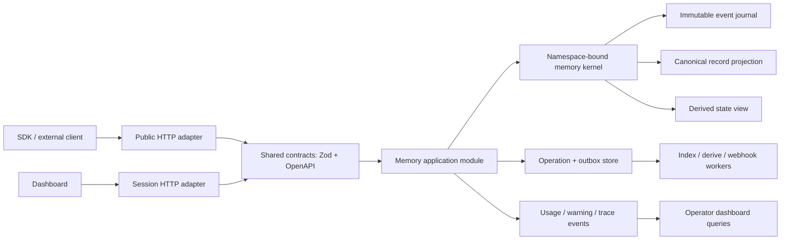

# fishmem Execution Plan

> Status: active
> Last updated: 2026-07-31

This is the single authoritative execution plan for the fishmem product,
public API, dashboard, core data architecture, and controlled algorithm
iteration.

- [ARCHITECTURE.md](./ARCHITECTURE.md) owns canonical-write and derived-view
  design
  rationale.
- [ROADMAP.md](./ROADMAP.md) owns research history, measured results, and the
  technique ledger.
- [PRIOR-ART.md](./PRIOR-ART.md) owns the five-repository review.
- [EVAL-PLAN.md](../benchmarks/EVAL-PLAN.md) owns benchmark protocol details.
- This document owns sequence, dependencies, status, and release gates.

Do not maintain another execution checklist in those documents. Change phase
status here when work starts or a gate is passed.

## Product Objective

fishmem must prove value as a production memory layer, not only as a retrieval
algorithm:

1. A stable mem0-style API with explicit differences, safe retries, and
   structural multi-tenancy.
2. An operator dashboard that explains data, cost, latency, and degradation.
3. A single-writer memory kernel whose derived structures can be rebuilt.
4. Algorithm changes that ship only after paired, budgeted, cross-dataset
   evidence.

Benchmark work remains a release gate. It does not lead product architecture;
the API and data invariants do.

## Decisions That Are Already Fixed

These are not open feature votes:

- `infer:true` makes one extraction call and stores only refined canonical
  records; `infer:false` stores submitted records verbatim with zero LLM calls.
- One add never creates parallel raw and extracted canonical records.
- Long text/files use a source-preserving document and RAG path, not the
  conversational fact writer.
- Add, update, delete-by-id, purge, export, and import are replayable and
  idempotent. Bulk delete is state-idempotent but does not promise replay of
  its execution-specific `deleted` count.
- Workspace isolation is structural, not a metadata convention.
- Derived state/profile/scenario data is a projection with canonical-record
  provenance.
- Default search makes zero LLM calls.
- Public HTTP, dashboard HTTP, SDKs, and docs consume one contract.
- Core memory does not own auth, billing, webhooks, or dashboard concerns.
- Node and Cloudflare are adapters to the same interfaces, not separate
  product implementations.
- A new retrieval signal must replace or outperform an existing stage; signals
  do not accumulate without deletion.

## Immediate Correctness Blockers

These block feature work:

| Blocker | Status | Required correction |
|---|---|---|
| Removed storage `mode` still exists in web config | Resolved in P0 | `infer` is the only canonical write selector; legacy storage modes are rejected |
| Workspace is stored as metadata `__ws` | In progress, P1 | Core/Web structural namespace path is implemented; finish the adapter conformance matrix and rollout validation |
| Public and dashboard memory handlers duplicate logic | Resolved in P3 | Both adapters use `MemoryApplication` and shared contracts |
| Graph write precedes embedding/index write | Resolved in P2 | Stable identities, journal checkpoints, replay, repair, and rebuild cover every mutation |
| API-key expiry is ignored | Resolved in P0 | Expired keys receive stable `API_KEY_EXPIRED`; explicit scopes remain P3 |
| Webhooks are sent inline, best-effort | Resolved in P4 | Persistent signed outbox, leases, retries, dead-letter state, and replay |
| Dashboard cost is derived from fixed credits | Resolved | Credits remain credits; USD appears only from provider usage plus an immutable price snapshot |
| Dashboard totals use capped row fetches | Resolved in P5 | Stable cursor traversal replaces capped totals; request aggregates remain server-side |
| Client-side backup re-adds content | Resolved in P2/P4 | Journal-safe snapshot import/export run through operation resources |
| Web app lacks a reliable repo CI gate | Resolved in P0/P5 | Node 20/22 checks plus production-mode Chromium and mobile Playwright run the operator lifecycle |

## Target Module Architecture



The first implementation stays one deployable application and may use one
physical database. These are module and data-ownership separations, not a
microservice plan.

## Core Data Architecture

### 1. Namespace-bound kernel

The security seam should be impossible to forget:

```ts
const projectMemory = memory.forNamespace(workspaceId);

await projectMemory.add(input, { userId, agentId, runId });
await projectMemory.search(query, { userId, agentId, runId });
```

Rules:

- HTTP callers never supply `workspaceId` in the body; auth binds it.
- Internal `ResolvedScope` always contains `namespaceId`.
- Memory, episode, event, entity, association, profile, state slot, vector
  payload, history, and maintenance rows carry `namespaceId`.
- Association creation verifies that both endpoints share a namespace.
- `reset`, `deleteAll`, maintenance, rebuild, and export require a bound
  namespace.
- The local library binds a deliberate `default` namespace; it does not use an
  optional empty security filter.

### 2. Immutable event journal

The event journal becomes the recovery source of truth:

```text
memory_events
  event_id
  namespace_id
  operation_id
  idempotency_key
  memory_id
  event_type       ADD | UPDATE | INVALIDATE | DELETE | PURGE
  payload_json
  occurred_at
  actor_json
```

Rules:

- `Idempotency-Key + namespaceId` is unique.
- ADD/UPDATE/DELETE append events; they do not erase audit evidence.
- DELETE creates a tombstone. PURGE is a separate privileged operation.
- Import restores event identity and timestamps; ordinary add does not pretend
  to be restore.
- Replaying events deterministically reconstructs the canonical record
  projection.

### 3. Materialized projections

The existing memory/vector/state stores become rebuildable views:

| Projection | Purpose | Consistency |
|---|---|---|
| Canonical memory projection | Current searchable records and metadata | Required before synchronous add succeeds |
| Vector/FTS index | Recall candidates | Synchronous for normal writes; repairable from journal |
| Association/entity index | Optional retrieval signals | Best-effort, observable, rebuildable |
| State sidecar | Current/as-of/history queries | Inline or deferred by explicit config |
| Profile/scenario views | Progressive disclosure | Deferred only; never authoritative |

Each projection stores `source_event_ids`, projection version, and build status.
A projection failure produces a persisted warning and repair operation, not an
empty catch.

### 4. Operation and outbox model

Long or retryable work uses one interface:

```ts
interface BackgroundTasks {
  enqueue(task: BackgroundTask): Promise<OperationRef>;
}
```

Explicit adapters:

- Node worker/queue adapter.
- Cloudflare Queue or `waitUntil` adapter.
- Deterministic in-process test adapter.

Tasks include derive, reindex, rebuild sidecar, maintenance, export, import,
purge, and webhook delivery. API clients inspect them through
`GET /v1/operations/{id}`.

### 5. Application module

`MemoryApplication` owns use-case policy:

- validate canonical commands;
- bind authenticated namespace and actor;
- enforce idempotency and authorization;
- call the namespace-bound kernel;
- record usage, warnings, and operation state;
- enqueue outbox work;
- return stable contract objects.

HTTP handlers only authenticate, parse through shared contracts, invoke the
application module, and serialize the response.

## Public API Plan

### Stable v1 surface

Keep familiar mem0-style operation names while treating FishMem's OpenAPI as
the contract:

- `POST /v1/memories`
- `POST /v1/memories/search`
- `GET /v1/memories`
- `GET|PUT|DELETE /v1/memories/{id}`
- `GET /v1/memories/{id}/history`
- `DELETE /v1/memories` by scope

No historical compatibility shim is required before production launch. Remove
aliases and stale response shapes now; after the first stable release, breaking
wire changes require a deliberate version decision.

### Contract module

Maintain `packages/contracts` because public routes, dashboard routes,
TypeScript SDK, Python conformance tests, and docs all consume it.

It owns:

- Zod request/response schemas;
- canonical snake_case wire types;
- stable error codes;
- OpenAPI generation;
- generated dashboard client types;
- examples validated during tests.

Do not maintain parallel handwritten `MemoryRow` and route-body interfaces.

### Required protocol behavior

| Area | Required behavior |
|---|---|
| Authentication | API key hash lookup, active status, expiry, permission scopes, namespace binding |
| Errors | `{ code, message, request_id, details? }`; no raw provider error leakage |
| Idempotency | Required/recommended for writes; replay returns original status/body |
| Pagination | Stable cursor based on `(created_at, id)`; no large offset contract |
| Limits | Explicit validated bounds; bulk delete iterates to completion or returns an operation |
| Observability | `x-request-id`; persisted latency, warning codes, retries, provider usage |
| Concurrency | Optimistic version on update; conflict returns 409 |
| Async work | 202 + operation resource when work is not complete |
| Rate limits | Per key/namespace policy with standard limit and retry headers |

### Additive domain endpoints

Add only after the underlying views pass their architecture gate:

- `GET /v1/state?user_id=&subject=&attribute=&as_of=`
- `GET /v1/state/history?...`
- `GET /v1/profile?...`
- `GET /v1/operations/{id}`
- `POST /v1/exports` and `POST /v1/imports`
- `GET /v1/health` for authenticated project health
- `GET /v1/entities` and `GET|DELETE /v1/entities/{type}/{id}` for
  structural scope owners

Search may opt into `trace`, but default responses expose stable concepts, not
internal RRF implementation details.

## Dashboard Plan

The dashboard is an operator console. It is not a marketing surface or a second
memory implementation.

### Information architecture

| Area | Required workflows |
|---|---|
| Overview | Correct aggregate counts, success/error rate, p50/p95, real token/USD, index and sidecar lag, active warnings |
| Memory Explorer | Canonical records, current state, timelines, tombstones, provenance drill-down |
| Playground | Separate Add/Search/State modes, explicit user/agent/run scope, request JSON, response, trace, context tokens |
| Operations | Requests, warnings, jobs, maintenance, reindex/rebuild, webhook attempts and replay |
| Project | API keys, members, engine, data export/import, destructive operations |
| Install | SDK and integration snippets generated from the current API contract |

### Required corrections to current pages

- Expose the canonical ingest contract (`infer=true` default, explicit
  `infer=false`) and the derivation toggle/schedule without inventing a second
  storage mode.
- Keep the resolved Entities view on the native canonical scope-aggregation
  API; do not reintroduce client-side full-memory scans.
- Replace capped client totals with aggregate endpoints.
- Replace guessed credits/USD with provider-metered values; display unknown
  until metering exists.
- Replace client-side backup with versioned server export/import operations.
  Import is restore-only: the target must be empty, namespace identity is
  safely rebound, canonical IDs/history are preserved, and projections rebuild.
- Add API key permissions and expiry controls.
- Make webhook deliveries replayable and show attempts/next retry.
- Persist Playground requests through the same application observability path.
- Make every state/profile row link to its canonical source memories.
- Show degraded states prominently: missing ANN index, failed derivation,
  vector repair pending, webhook backlog, provider failures.

### Dashboard acceptance journey

Playwright must cover this complete workflow:

1. Admin configures and tests an embedder.
2. Admin creates a scoped, expiring API key.
3. Client adds a memory with an idempotency key.
4. Client retries and receives the same result.
5. Client searches and Dashboard shows the request, usage, and trace.
6. A changed fact appears in current state and history with canonical
   `source_ids` provenance.
7. Operator exports, deletes, imports, and verifies identity/history recovery.
8. A second workspace cannot read any of the first workspace's artifacts.

## Controlled Algorithm Iteration

Algorithm work is a sequence of falsifiable experiments, not an implementation
backlog.

### Accepted baseline

Every experiment starts from one frozen product baseline:

- `infer:true` one-call refined canonical storage for conversations;
- `infer:false` only for already-distilled records;
- fixed chunking and topK recorded in the run;
- semantic retrieval with currently accepted temporal behavior;
- default search makes zero LLM calls;
- derivation and unproven retrieval signals disabled unless they are the
  treatment;
- exact fishmem and mem0 versions plus adapter hash recorded;
- fixed answer/judge prompts and tokenizer;
- provider usage and warning diagnostics complete.

Changing two treatment variables invalidates a causal claim.

### Experiment record

Each candidate creates a checked-in manifest before a paid holdout run:

```json
{
  "experimentId": "retrieval-neighbor-expansion-v1",
  "hypothesis": "Document-neighbor expansion improves multi-hop RAG without adding more than 20% context tokens.",
  "treatment": { "neighborExpansion": 1 },
  "baselineConfigHash": "...",
  "datasets": ["locomo-holdout", "longmemeval-s"],
  "primaryMetric": "multi_hop_accuracy",
  "guardrails": ["overall_accuracy", "context_tokens", "search_p95", "warnings"],
  "stopRule": "paired-ci"
}
```

The result stores git SHA, dataset revision/split, item IDs, model versions,
price snapshot, seeds, usage, warnings, and raw paired outputs.

### Six experiment gates

| Gate | Requirement | Failure action |
|---|---|---|
| A. Mechanism | Unit/integration tests prove the feature changes only the intended stage | Fix design; no benchmark |
| B. Dev signal | Same-store paired dev run shows the predicted category movement | Stop candidate |
| C. Frozen holdout | Paired CI/McNemar or bootstrap supports the primary claim | Reject default |
| D. Cross-dataset | Effect transfers to a second relevant dataset or FishBench workload | Keep experimental or delete |
| E. Budget | Context, calls, USD, p50/p95, memory count, and warnings stay within declared budget | Opt-in only or delete |
| F. Operational | Namespace, replay, rebuild, deletion, and scale tests remain correct | Block release |

### Default, opt-in, and rejection policy

A feature may become default only when:

- the primary paired holdout confidence interval excludes zero, or a
  pre-registered non-inferiority/quality tradeoff is met;
- required datasets have no critical category regression beyond the declared
  margin;
- default search adds no LLM call;
- search p95 is at most 1.2x baseline unless the quality/cost frontier is the
  explicit product claim;
- mean context tokens remain within the pre-registered budget;
- warning/degradation rate does not increase materially;
- the implementation replaces an existing stage or justifies why deletion is
  impossible.

An opt-in feature needs a repeatable target-workload win and fully disclosed
cost. A candidate is deleted when it fails two relevant datasets, only helps a
single inspected benchmark slice, or needs dataset-specific prompts/boosts.

### Algorithm queue

Order matters. Do not start a later row before earlier measurement dependencies
exist.

| Priority | Candidate | Hypothesis | Primary evidence | Current disposition |
|---|---|---|---|---|
| 0 | Production-default rerun | Measure the shipped `infer:true` path against current mem0 | LOCOMO + LongMemEval | Blocks superiority claims |
| 1 | Deterministic temporal/state routing | State queries should use the sidecar; ordinary recall should query canonical records | LongMemEval update/temporal + FishBench stale facts | Architecture differentiator; unproven as default |
| 2 | Conservative duplicate suppression | Duplicate canonical records waste topK and context without adding evidence | LOCOMO single-hop/multi-hop + MemBench | Test before graph expansion |
| 3 | Document neighbor expansion | Adjacent document chunks recover distributed evidence | Long-document QA + ConvoMem | Blocked on document API |
| 4 | Entity/co-occurrence boost | Orthogonal entity evidence helps multi-hop where vector similarity misses | LOCOMO multi-hop + BEAM multi-session | Experimental; boost-only |
| 5 | Local cross-encoder rerank | No-token rerank improves precision enough to pay latency | LOCOMO/LongMemEval quality-latency curve | Opt-in candidate |
| 6 | Progressive profile/scenario view | Higher-level summaries reduce context on profile/long-task queries while provenance protects accuracy | FishBench + LongMemEval preference/update | Deferred until state view passes |
| 7 | Dynamic Hebbian reinforcement | Repeated useful co-recall improves future retrieval | Stateful FishBench repeated workflows | Deferred; LOCOMO cannot validate it |
| 8 | Agentic/deep recall | Extra query-time reasoning raises the quality ceiling | BEAM synthesis + explicit premium workload | Never default |

Rejected/default-off decisions remain closed unless the representation or
measurement premise changes:

- lexical/BM25 fusion on the historical raw representation: measured wash,
  not transferable to the current canonical representation;
- automatic query router: harmful in prior ablation;
- historical raw-versus-extraction ablations: research evidence only, not a
  production architecture veto;
- benchmark-specific micro-boosts: permanent rejection;
- mandatory four-level hierarchy: no evidence and unnecessary write cost.

### Benchmark matrix by claim

| Claim | Required datasets |
|---|---|
| Factual and temporal answer quality | LOCOMO holdout |
| Update, abstention, preference, multi-session | LongMemEval oracle then `s` |
| Synthesis, contradiction, ordering, scale | BEAM 100K before 1M/10M |
| Retrieval evidence quality | MemBench + ConvoMem |
| Persona evolution | PersonaMem |
| Agent workflow continuity | MemoryArena + FishBench |
| Isolation, deletion, injection, stale action | FishBench adversarial suite |
| Operational scale | Synthetic 1K/100K/1M memory load profiles |

No general “beats mem0” claim is allowed from one dataset or one metric.

## Execution Phases

Estimates assume one senior engineer focused on this repository. Gates, not
calendar dates, control progression.

### P0 - Contract stabilization (2-4 days)

Status: completed 2026-07-13

- restore web dependency installation and add Node 20/22 typecheck/build CI;
- remove the stale storage mode from web config and migrations;
- make `infer` the only canonical write selector and derivation an explicit
  projection;
- enforce API-key expiry;
- remove fake cost values;
- add core/web configuration contract tests.

Exit: a saved dashboard config starts the engine; web typecheck/build and a
minimal authenticated add/search route test pass in CI.

Delivered: real SQLite migration tests, explicit rejection of legacy
`extract`, authenticated workspace-bound add/search route tests, exact request
aggregates, removal of synthetic credits/cost, and Node 20/22 Web CI.

### P1 - Structural namespace isolation (1-2 weeks)

Status: in progress

- add `namespaceId` to schemas, filters, payloads, sidecar, and projections;
- implement `Memory.forNamespace()`;
- migrate existing `__ws` data;
- bind public and dashboard auth to the namespace facade;
- add conformance tests for every graph/vector/sidecar adapter.

Delivered so far: `Memory.forNamespace()`, structural namespace columns and
filters across core projections, SQLite/Postgres auto-migration support, Web
API/dashboard/maintenance binding, legacy `__ws` migration, and adversarial
in-memory plus persistent SQLite isolation tests. CI now runs real
PostgreSQL+pgvector+sidecar, Miniflare D1+sidecar, and Qdrant namespace
contracts; Vectorize has a strict binding contract and explicitly rejects
unsupported enumeration instead of returning false success. Versioned
namespace snapshot export now preserves memories (including forgotten rows),
history, associations, entities, mentions, and episodes while marking vectors
and sidecar state as rebuildable projections. Remaining P1 work is a
credentialed remote Vectorize smoke test. Transactional snapshot import remains
in P2 because D1 needs journal/idempotency before replace can be interruption
safe.

Exit: adversarial cross-workspace tests pass for CRUD, search, state, graph,
maintenance, rebuild, export, and delete.

### P2 - Journal, idempotency, and repair (1-2 weeks)

Status: completed 2026-07-13

- add operation/event tables;
- make write retries idempotent;
- track projection/index status;
- implement replay and repair;
- make delete/tombstone/purge semantics explicit;
- replace client backup with server snapshot primitives.

Delivered: immutable events and leased operation journals across SQLite,
PostgreSQL, and D1; namespace-scoped idempotency and exact response replay for
ADD/UPDATE/INVALIDATE/DELETE/PURGE/import/rebuild; stable identities, CAS lease
recovery, deterministic mutation replay, tombstone versus purge semantics,
vector/sidecar projection verification, and staged namespace snapshot import.
Kill-after-record-commit tests prove retry repairs vectors without duplicating canonical
rows, and real PostgreSQL, D1, and Qdrant integration tests cover recovery and
namespace isolation.

Exit: kill/retry/replay testing loses no acknowledged write and creates no
duplicate; a full projection rebuild matches the original state.

### P3 - Shared API contracts and application module (1-2 weeks)

Status: completed 2026-07-13

- create `packages/contracts`;
- extract `MemoryApplication` from the two route modules;
- generate OpenAPI and typed dashboard clients;
- add cursor, request ID, key scopes, stable errors, and optimistic update;
- add route and SQLite integration tests.

Exit: public and dashboard adapters pass the same application contract suite;
route modules contain no memory business policy.

Delivered: `packages/contracts` Zod/OpenAPI wire contracts, one
`MemoryApplication`, stable `(created_at,id)` cursors, request IDs and stable
errors, API-key permission/expiry enforcement, optimistic update conflicts,
and shared route plus SQLite journey tests. The contract now also includes a
bounded logical memory-filter AST with canonical residual evaluation and a
paginated scope-entity API shared by HTTP, Dashboard, Desktop, TypeScript, and
Python adapters.

### P4 - Async operations and observability (1 week)

Status: completed 2026-07-13

- add task/outbox adapters;
- move derivation, webhooks, rebuild, import/export, and maintenance into
  operations;
- instrument provider calls, tokens, price snapshot, retries, and warning codes;
- add aggregate dashboard query modules.

Exit: every degradation is persisted; webhooks retry idempotently; Dashboard
cost and latency match provider usage event aggregates.

Delivered: leased operation workers for derive/rebuild/maintenance/import/
export/purge, queued profile refresh, signed webhook outbox with replay,
provider token/latency events and immutable price snapshots, exact aggregate
cost/latency/warning queries, and persisted task/provider/index warnings. The
IVFFlat performance downgrade emits `pgvector_ivfflat_index_failed` and has a
regression test; no empty catch remains.

### P5 - Operator dashboard (1-2 weeks)

Status: completed 2026-07-13

- implement the target information architecture;
- build Memory Explorer provenance drill-down;
- rebuild Playground around canonical Add/Search/State contracts;
- add Operations and project health views;
- implement the acceptance journey in Playwright.

Exit: the complete operator journey passes on Node/SQLite and Cloudflare test
adapters without seeded fake metrics.

Delivered: canonical Add/Search/State Playground, operation health/retry/
rebuild console, API-key scopes/expiry, immutable memory history (including
tombstoned records), real cursor traversal for global memory/entity views, and
production-mode Playwright on Desktop Chrome plus Pixel 7. The browser journey
now performs inferred add, exact replay, search trace, update, history, delete,
server export, permanent project deletion, Dashboard restore into a different
empty project, and ID/history verification. Durable tasks dispatch immediately
and a one-minute cron reclaims pending/expired work. The Entities page now uses
the native paginated scope-entity application API and one idempotent scope
deletion instead of fetching every memory and issuing per-record mutations.

### P6 - State/profile product surface (1-2 weeks)

Status: completed 2026-07-13 (quality disposition: opt-in)

- expose state/history/profile endpoints;
- wire persistent sidecars for each production runtime;
- add derivation lag, rebuild, and provenance integrity UI;
- validate state routing and progressive disclosure through the algorithm
  gates.

Exit: update/temporal/stale-fact quality improves at an acceptable token and
cost budget; otherwise state/profile remains opt-in.

Delivered: authenticated state/history/profile contracts, persistent D1 and
libSQL sidecars in production engine construction, queued profile refresh,
state provenance links to canonical memories, projection lag/repair health, rebuild
controls, and `benchmarks/experiments/state-profile-v1.json`. The executable
cross-dataset evidence gate intentionally remains closed until same-harness
fishmem/mem0 LOCOMO, LongMemEval, and BEAM holdouts include complete usage,
cost, reliability, and paired statistics. Therefore derivation remains opt-in;
no unrun quality claim is treated as evidence.

### P7 - Continuous controlled algorithm loop

Status: ready; candidates remain gated on complete benchmark evidence

- execute the algorithm queue one candidate at a time;
- commit manifests and raw results;
- update the technique ledger with accepted/rejected outcomes;
- remove failed or superseded implementations promptly.

Exit per candidate: accepted default, documented opt-in, or deleted.

### P8 - Source objects and file ingestion

Status: in progress 2026-07-30

- keep `DocumentCorpus` as the only source/version/chunk writer;
- externalize exact Cloudflare originals to R2 without changing the public
  document contract;
- preserve checksum verification, snapshot restore, idempotent source-family
  deletion, and namespace purge across the relational/object-store seam;
- add multipart textual-file ingestion through the same application command;
- add asynchronous, observable extraction jobs before claiming PDF/DOCX/OCR
  support;
- raise the 1,000,000-byte request boundary only with streaming/object-first
  ingestion, explicit quotas, and remote acceptance evidence.

Delivered so far: an optional `DocumentOriginalStore` seam in the kernel, an
R2 adapter in the Cloudflare application, inline local storage for Desktop and
Node, checksum/size verification on content reads, exact-original snapshot
export/restore, replay-safe document deletion, namespace cleanup, and adapter
tests. D1 now stores descriptors and deterministic chunks instead of a second
copy of newly ingested Cloudflare originals. The public and dashboard routes
now share one JSON/multipart request parser; TypeScript, Python, async Python,
and Desktop SDK adapters expose textual `documents.upload`, and the Sources
dashboard sends the original `File` rather than a browser-decoded JSON copy.
The object-first source-asset lifecycle now accepts supported PDF, Office,
EPUB, email, image, and text files up to 25 MB/300 pages; exact bytes and
lossless artifacts are immutable, Docling extraction is asynchronous, and the
same durable `document_extract` operation works through Cloudflare
R2/Queue/Container/DLQ/cron and Node/Docker volume/poller adapters. SDK upload
helpers calculate SHA-256 and expose operation/source polling without hiding
the asynchronous boundary.

Exit: representative text, PDF, Office, and image uploads survive retry,
list/search/content, snapshot restore, source deletion, project purge, queue
redelivery, and scheduled repair on staging; production-volume container and
query-visibility SLO evidence remains open.

## Test and Release Gates

Every release that changes API, storage, dashboard, or retrieval must pass:

1. Core unit tests and all storage-adapter conformance suites.
2. Namespace isolation and authorization tests.
3. Journal/idempotency/replay/rebuild tests.
4. Public API contract and OpenAPI example tests.
5. Dashboard application and Playwright acceptance tests.
6. LOCOMO, LongMemEval, and BEAM offline smoke tests.
7. Relevant paired holdout eval for algorithm changes.
8. Complete provider usage, context-token, warning, retry, and timeout evidence.
9. Node build plus Cloudflare dry-run build.
10. Migration forward test and backup/restore verification.

Publication additionally requires the strict benchmark evidence gate defined in
[benchmarks/EVAL-PLAN.md](../benchmarks/EVAL-PLAN.md).

## Non-goals Until These Gates Pass

- More vector/LLM providers for feature-matrix parity.
- A mandatory L0-L3 hierarchy.
- A graph visualization without an operator debugging workflow.
- A core `answer()` pass-through duplicating agent frameworks.
- Billing logic based on synthetic credits.
- More retrieval lanes before current lanes are measured and subtracted.
- Microservices, Kafka, or a separate graph database.
- 1M/10M benchmark spend before 100K behavior and cost are understood.

## Definition of Product Readiness

fishmem is ready for a defensible public product claim when all are true:

- API retries cannot duplicate or lose acknowledged memory.
- Namespace isolation is structural across every projection and operation.
- Dashboard reports real counts, latency, cost, and degradation.
- Raw evidence can rebuild recall and derived state.
- State/profile behavior is provenance-linked and benchmark-validated.
- fishmem beats mem0 on at least three independent value dimensions under the
  same harness, with raw evidence and confidence intervals.
- No current default exists solely because it once helped one benchmark.
